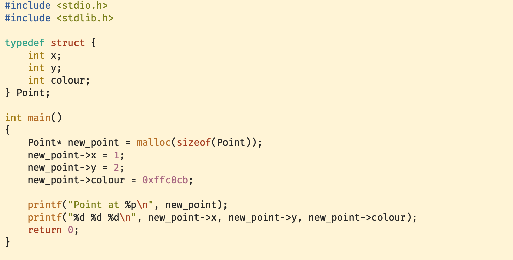
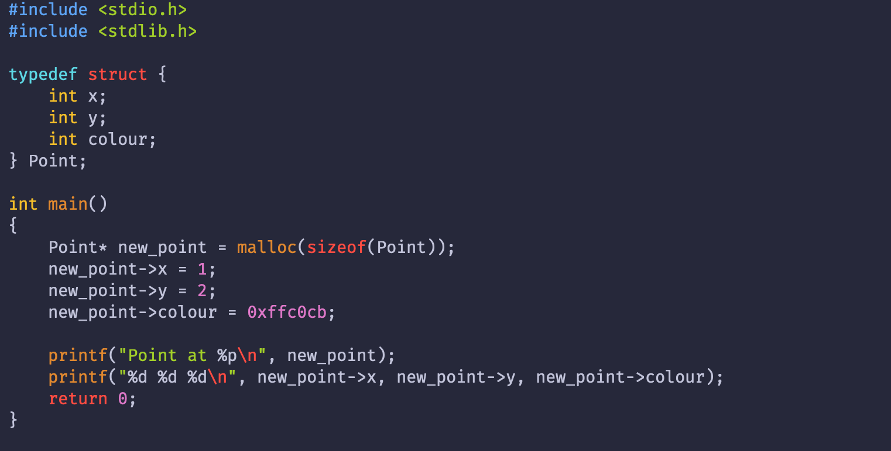

# Fox.vim

An elegant theme for editing at all times of the day
> Note: Requires a true colour (8-bit) terminal

## Installation
Simply use your favourite vim plugin manager to install (listed below are `vim-plug` and `vundle`:

#### vim-plug
```
plug 'AxolotlC/Fox.vim'
```
#### Vundle
```
Plugin 'AxolotlC/Fox.vim'
```

## Usage
To enable the theme, simply put `colorscheme fox` in your `.vimrc` or equivalent. In order to change the style of
the theme, use `let g:fox_type='<name>'` where name is the name of your scheme type.

For example, to use the Fox Night theme, you would put `let g:fox_type='night'` in your `.vimrc` before calling
`:colorscheme`.

---
## Gallery
#### Fox Regular

#### Fox Day

#### Fox Night


