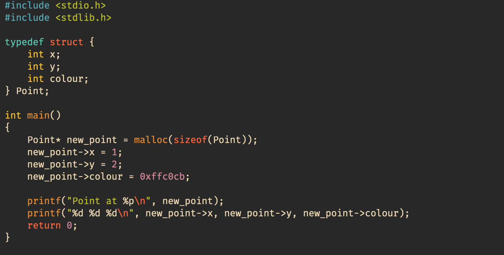

# Fox.vim

An elegant theme for editing at all times of the day
> Note: Requires a true colour (8-bit) terminal

## Installation
Simply use your favourite vim plugin manager to install (listed below are `vim-plug` and `vundle`:

#### vim-plug
```
plug 'AxolotlC/Fox.vim'
```
#### Vundle
```
Plugin 'AxolotlC/Fox.vim'
```

---
## Gallery
#### Fox Regular

